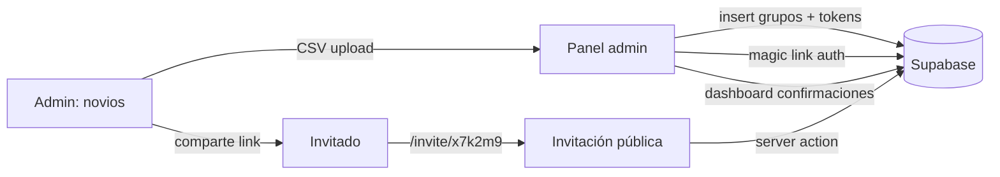
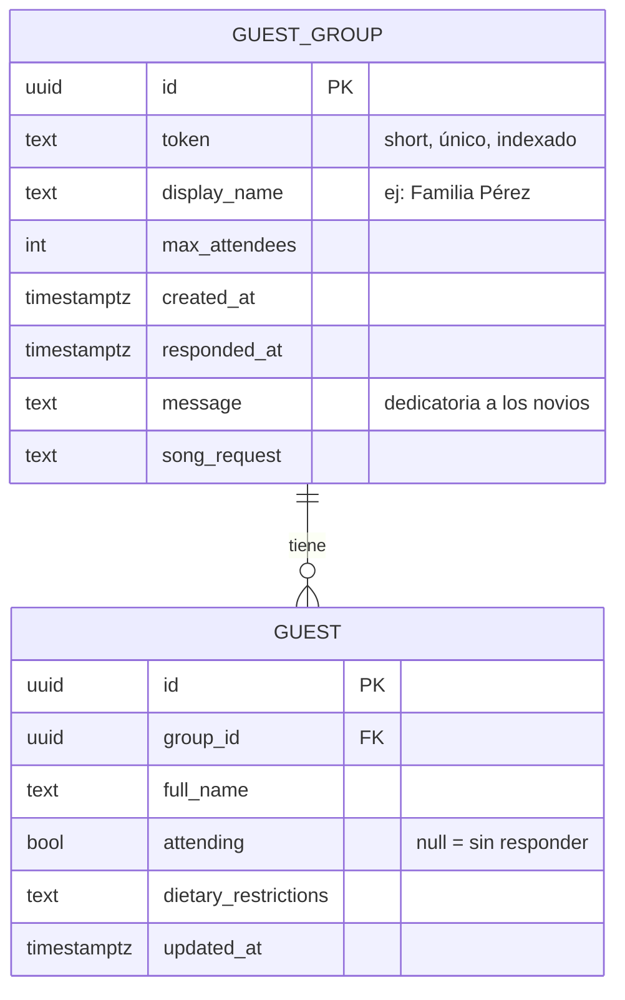

# Brainstorm — SPA de invitaciones de boda

## Qué estamos construyendo

SPA web responsive para gestionar las invitaciones digitales a una boda, con dos superficies:

1. **Invitación pública personalizada** — Cada grupo (familia/pareja) recibe un link único con un token corto. Al abrirlo, ven la invitación con su nombre, los detalles del evento, y un formulario para confirmar asistencia por persona.
2. **Módulo de administración** — Panel para los novios donde se carga la lista inicial de invitados por CSV, se ven las confirmaciones en vivo, y se exporta el estado de RSVP.

## Por qué este enfoque

**Stack: Next.js 15 (App Router) + Supabase + Vercel + Tailwind + shadcn/ui**

- Next.js sobre Vercel es el camino de menor fricción para deploy.
- Supabase resuelve auth (magic link), DB Postgres y storage en una sola plataforma.
- Server-first reduce código de cliente y mantiene los tokens y la lógica de validación fuera del bundle.
- Tailwind + shadcn/ui acelera UI elegante sin diseñar componentes desde cero.

**Arquitectura — Enfoque A: Server actions con service role**

- Las páginas de invitación renderizadas como server components: el server lee el token de la URL, busca el grupo en Supabase, y entrega HTML personalizado.
- El form de RSVP usa server actions: el server valida que el token existe y aplica el update con el service role key (RLS bloquea acceso público directo).
- Admin con Supabase Auth (magic link a un email autorizado) y RLS policy que solo permite acceso a usuarios con rol admin.

## Decisiones clave

| Decisión | Elección | Razón |
| --- | --- | --- |
| Modelo de invitado | Por grupo/familia con N personas asociadas | Refleja la realidad social (parejas, familias) y reduce links a distribuir |
| Identificador en URL | Token corto aleatorio (ej: `/invite/x7k2m9`) | No adivinable, no expone nombres, links bonitos para WhatsApp; rotable si se filtra |
| Auth admin | Supabase Auth con magic link | Robusto, sin gestión de passwords, escalable a la pareja |
| CSV | Carga inicial de invitados | Pobla la base con grupos + personas; tokens se generan al insertar |
| Framework | Next.js 15 App Router | Default de Vercel; server actions hacen el form RSVP trivial |
| Estilo visual | Inspirado en deluxe-ii, no clonado | Tailwind + shadcn/ui, tipografías serif elegantes, paleta y assets propios |
| Enfoque | Server actions + RLS estricta | Token nunca cruza al cliente JS más de lo necesario; lógica simple de validar |
| Datos del evento | Hardcodeados con datos del usuario | Fecha, lugar y nombres se cargan al implementar; no requieren panel de configuración |
| Deadline RSVP | Configurable desde admin | Tras la fecha, el form se bloquea automáticamente con un mensaje |
| Edición post-submit | Permitida hasta el deadline | El invitado puede volver al link y editar; quedan trazas con `updated_at` |
| Notificaciones | Email a los novios por cada RSVP | Trigger de Supabase → edge function → Resend al email autorizado |
| Idioma | Solo español | Sin i18n; reduce complejidad |
| Storage de fotos | Supabase Storage (bucket público) | Mismo proveedor que la DB, sin gestión extra |
| Dominio | `*.vercel.app` por ahora | Sin gasto extra; dominio custom se evalúa luego |

## Modelo de datos (esbozo)

## Alcance funcional

### Invitación pública (`/invite/[token]`)
- Hero con nombres de los novios, fecha, countdown y saludo personalizado al grupo
- Sección Ceremonia + Recepción con horarios y links a Google Maps
- Dress code con paleta de colores e indicaciones especiales
- Mesa de regalos, lluvia de sobres, y galería de fotos de la pareja
- Formulario RSVP por persona del grupo, con:
  - Asiste sí / no / aún no decido
  - Restricciones alimentarias (texto libre)
  - Canción para la fiesta
  - Mensaje/dedicatoria a los novios (a nivel grupo)
- Confirmación visual al enviar; permite editar la respuesta volviendo al link

### Módulo admin (`/admin`)
- Login por magic link (email autorizado en env vars o tabla `admins`)
- Dashboard con KPIs:
  - Total invitados / total grupos
  - Confirmados sí / confirmados no / sin responder
  - % de respuesta sobre el total
- Tabla de grupos con búsqueda y filtro por estado
- Detalle por grupo: lista de personas, RSVP individual, mensaje, canción
- Importador CSV inicial con preview, validación, y rollback si falla
- Exportar CSV con todas las respuestas

## Resolved Questions

1. **Datos del evento** — El usuario aporta fecha, lugar y nombres durante `/ce:plan`. Se hardcodean en código (constantes o JSON de config), sin panel de configuración.
2. **Deadline de RSVP** — Configurable desde admin. Tras esa fecha el form se bloquea con mensaje. Tabla `wedding_config` con campo `rsvp_deadline timestamptz`.
3. **Edición post-confirmación** — Permitida hasta el deadline. Sin lock al primer submit; el modelo guarda `updated_at` para trazabilidad.
4. **Notificaciones** — Email a los novios por cada RSVP. Implementación: trigger de Postgres tras `UPDATE` en `guest` que llama a una Supabase edge function, la cual usa Resend para mandar el email a la dirección admin.
5. **Idioma** — Solo español. Sin librería de i18n.
6. **Storage de fotos** — Supabase Storage con bucket público `wedding-assets`. Las URLs públicas se referencian desde la invitación.
7. **Dominio** — `*.vercel.app` por ahora. Migración a dominio custom queda como decisión post-MVP.

## Open Questions (a confirmar en /ce:plan)

Ninguna queda abierta a nivel de alcance. Los datos concretos del evento (fecha, nombres, locación, paleta de colores, deadline RSVP, email autorizado de admin) se aportan al inicio del plan.

## Próximo paso

Correr `/ce:plan docs/brainstorms/2026-05-09-wedding-invitation-spa-brainstorm.md` para definir tareas concretas, estructura de carpetas, schema final con migraciones, y orden de ejecución.
