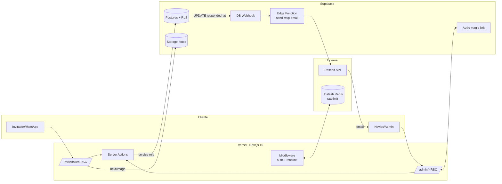
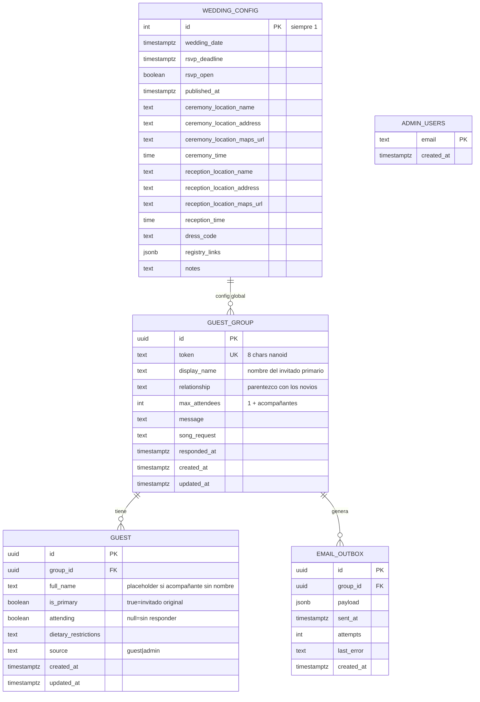
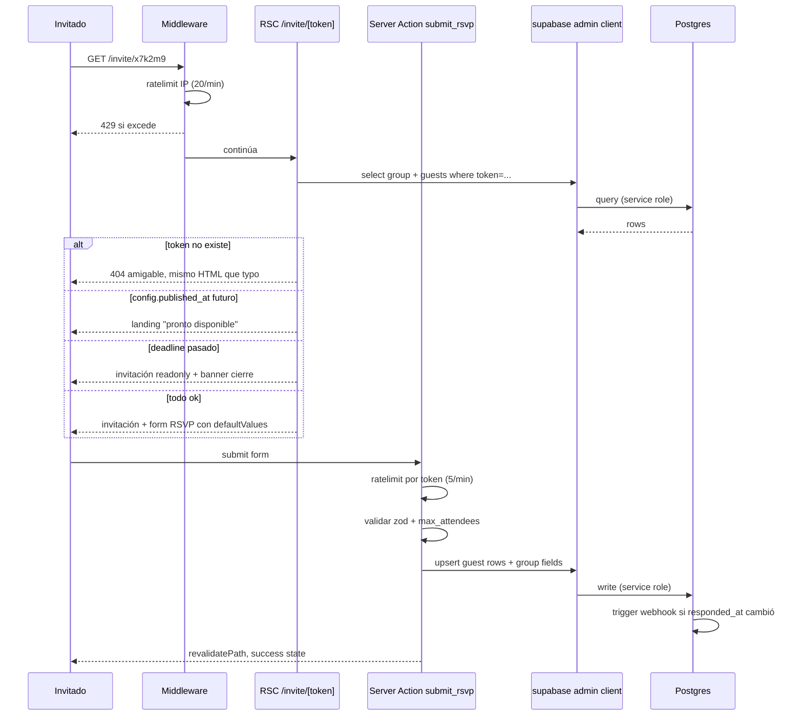
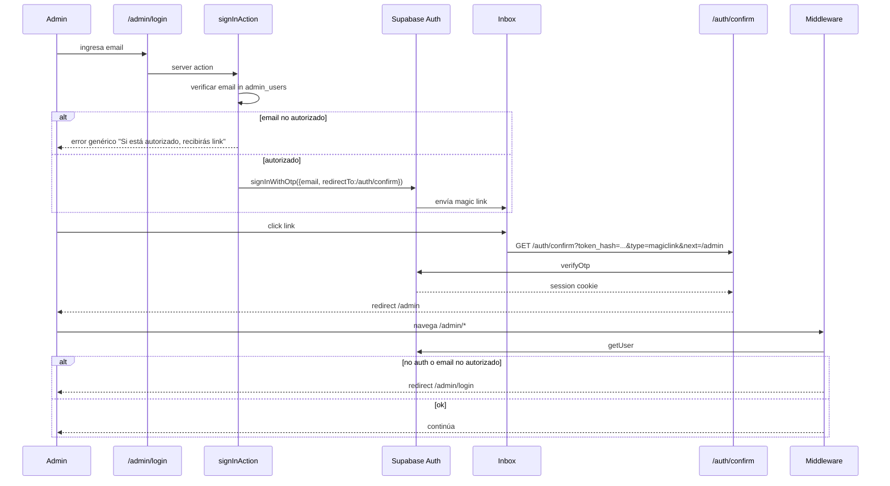
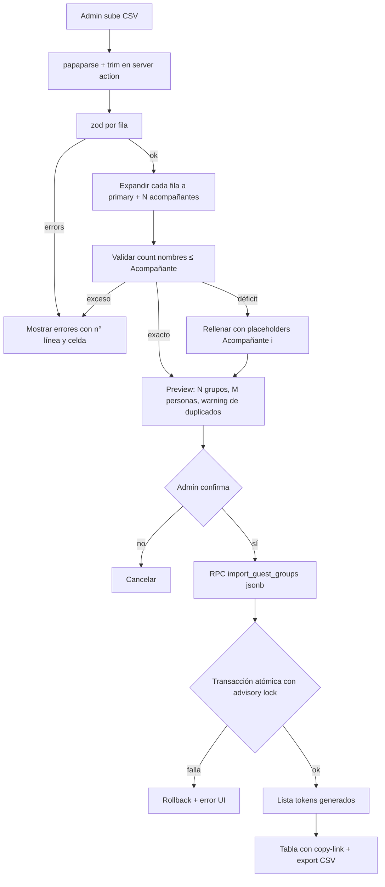
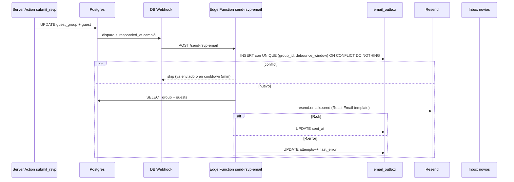

# SPA de invitaciones de boda (Next.js 15 + Supabase)

> **Origen:** [docs/brainstorms/2026-05-09-wedding-invitation-spa-brainstorm.md](../brainstorms/2026-05-09-wedding-invitation-spa-brainstorm.md). Decisiones clave heredadas: stack Next 15 + Supabase + Vercel, server actions con service role, modelo por grupo/familia con token aleatorio corto, admin con magic link, CSV de carga inicial, notificaciones por email, storage en Supabase, solo español.

## Overview

Construir un SPA de invitaciones digitales para una boda con dos superficies:

1. **Invitación pública por token** (`/invite/[token]`): cada grupo (familia/pareja) recibe un link único; ven la invitación, las secciones del evento, y un formulario para confirmar asistencia individual por persona.
2. **Módulo admin** (`/admin`): los novios cargan la lista inicial vía CSV, monitorean confirmaciones en un dashboard, exportan resultados, y configuran parámetros (deadline, datos del evento).

Stack: **Next.js 15 (App Router) + Supabase (Postgres + Auth + Storage + Edge Functions) + Vercel + Tailwind v4 + shadcn/ui + Resend**. Arquitectura server-first con server actions (service role) y RLS estricta que bloquea acceso público directo.

## Problem Statement

Las invitaciones impresas son caras, lentas de actualizar, y no permiten capturar respuestas estructuradas. Los servicios SaaS (fixdate.io, paperless post, etc.) son rentables pero limitan la personalización, el modelo de datos y la integración con flujos posteriores (catering, asignación de mesas).

Necesitamos una solución propia que:
- Capture respuestas estructuradas (asistencia, restricciones alimentarias, canción, mensaje) por persona dentro de un grupo
- Sea distribuible vía un link único por grupo (WhatsApp friendly)
- Permita carga masiva inicial vía CSV
- Tenga un dashboard claro con KPIs y export de resultados
- Cueste cerca de cero hosting (Vercel + Supabase free tier)
- Sea editable hasta el deadline (los invitados cambian de opinión)

## Proposed Solution

Un SPA Next.js desplegado en Vercel, con Supabase como backend de DB/Auth/Storage. Dos rutas principales: `/invite/[token]` (público, server-rendered, mobile-first) y `/admin` (autenticado vía magic link). Toda escritura pasa por server actions que usan el service role key; las RLS niegan acceso al rol `anon`. La capa de notificación es asíncrona vía Database Webhook → Edge Function → Resend, con cola de outbox para idempotencia y reintentos.



## Technical Approach

### Arquitectura — Server-first con service role

**Decisión heredada del brainstorm (Enfoque A).** Tres clientes Supabase coexisten:

- **Browser client** (`@supabase/ssr` `createBrowserClient`): solo para auth flow del admin (magic link). Anon key.
- **Server client** (`@supabase/ssr` `createServerClient`): server components y server actions del admin. Lee la sesión vía cookies. Anon key.
- **Admin client** (`@supabase/supabase-js` `createClient`): solo en server-only modules. Service role key. Bypass de RLS. Toda escritura pasa por acá.

**RLS estricta:** todas las tablas tienen `enable row level security` y **ninguna policy** para roles `anon` / `authenticated`. El acceso público solo existe a través de server actions que validan el token y usan el admin client. Esto significa: aunque alguien filtre el anon key del navegador, no puede leer ni escribir nada.

### Stack de dependencias

| Categoría | Librería | Versión target |
|---|---|---|
| Framework | next | ^15.x |
| UI | tailwindcss | ^4.x |
| UI | shadcn/ui (CLI) | latest |
| Forms | react-hook-form + @hookform/resolvers | ^7.x |
| Validación | zod | ^3.x |
| Supabase JS | @supabase/ssr + @supabase/supabase-js | ^0.5.x / ^2.x |
| CSV | papaparse | ^5.x |
| IDs | nanoid | ^5.x |
| Rate limit | @upstash/ratelimit + @upstash/redis | latest |
| Email | resend + react-email | ^6.x / ^4.x |
| Date utils | date-fns + date-fns-tz | ^4.x |

### Modelo de datos



### Convención de tokens

- Alfabeto: `23456789ABCDEFGHJKLMNPQRSTUVWXYZ` (32 chars, sin ambiguos como `0/O`, `1/I/L`)
- Longitud: **8** caracteres → `32^8 ≈ 1.1 × 10¹²` combinaciones
- Generación: SQL function `generate_invitation_token()` con retry hasta encontrar uno único
- Brute force con rate limit de 20 req/min por IP es inviable a escala humana

### Flujos clave

#### Flow 1 — Invitación pública



**Casos manejados explícitamente:**
- Token inválido o typo → 404 con mensaje amigable; mismo timing/HTML que existente para evitar enumeración
- Pre-publicación (`published_at` futuro) → landing genérico "Pronto disponible"
- Post-deadline → form readonly + banner "El RSVP cerró el DD/MM/YYYY. Para cambios, contactanos por WhatsApp"
- Aforo excedido (más confirmaciones que `max_attendees`) → server action rechaza con error específico
- Edición concurrente → granularidad por `guest.id` evita la mayoría de colisiones; campos a nivel grupo usan optimistic concurrency con `updated_at`
- `<meta name="referrer" content="no-referrer">` para evitar que el token leak al hacer click a Maps

#### Flow 2 — Admin auth (magic link)



**Whitelist:** tabla `admin_users` con emails autorizados (también seedeable desde env var `ADMIN_EMAILS`). `signInWithOtp` solo se invoca si el email está en la tabla; respuesta genérica para no leakear quién está autorizado.

#### Flow 3 — CSV import



**Contrato del CSV (basado en `Invitados - Hoja 1.csv` real del usuario):**

```csv
Nombre,Parentezco,Acompañante,Nombre acompañantes
"Paola Rivas","mamá del novio",3,"Fabio Reyes, Sebastián Rivas, Andrés Felipe Rivas"
"Esperanza de Rivas","Abuela del novio",1,"Jaime Rivas"
"Erick Gonzalez","Amigo",0,
"Valeria Llanos","Amigo",1,"Karol"
"Shalma Urazán","Amigo",1,
```

**Columnas:**
- `Nombre` — string, requerido. Nombre del invitado primario (el que recibe el link).
- `Parentezco` — string, opcional. Parentesco/relación (ej: "mamá del novio", "Amigo", "Tía de la novia"). _Nota: el usuario lo escribe así, con z; preservar tal cual._
- `Acompañante` — entero ≥ 0, requerido. Cantidad de acompañantes que el primario puede traer.
- `Nombre acompañantes` — string, opcional. Lista de nombres separados por `, ` (coma + espacio); el campo entero va entre comillas si tiene comas. Puede estar vacío aunque `Acompañante > 0` (el primario completa los nombres después al confirmar).

**Reglas de parseo:**
- Encoding: UTF-8 (con o sin BOM)
- Separador: coma; quoting estándar para celdas con comas internas
- **Trim de whitespace** en todas las celdas (la fuente original tiene espacios trailing — visible en `"Diana Rodriguez "`, `"Jaime Rivas"`, etc.)
- Cada fila = 1 grupo. No se agrupa por `Nombre` (los homónimos siguen siendo grupos separados; admin verifica visualmente en preview).
- `max_attendees` se calcula como `1 + Acompañante` (primario + N acompañantes).
- Si `Nombre acompañantes` tiene **menos** nombres que `Acompañante`, el resto se crea con placeholder `"Acompañante {i}"` y se marca `full_name` como editable en el form (el primario lo completa al confirmar).
- Si `Nombre acompañantes` tiene **más** nombres que `Acompañante`, el import falla con error de fila específico.
- Si `Acompañante = 0` y `Nombre acompañantes` tiene contenido, falla.
- Cap: 500 filas por import.
- Modo: **append-only**. Re-import con `Nombre` duplicado al de un grupo existente → warning visible en preview (admin confirma o cancela). No hay merge automático.

**Resultado por fila importada:**
- 1 inserción en `guest_group` con `display_name = Nombre`, `relationship = Parentezco`, `max_attendees = 1 + Acompañante`, `token = generate_invitation_token()`.
- 1 inserción en `guest` con `full_name = Nombre`, `is_primary = true`.
- N inserciones en `guest` con `full_name = parsed_name` o `Acompañante {i}`, `is_primary = false`.

**Output post-import:** vista admin con tabla `[display_name | token | link completo | copiar]` y botón "Exportar tokens a CSV" para distribuir por WhatsApp.

#### Flow 4 — Notificación email (asíncrono, idempotente)



**Diseño:**
- Cola `email_outbox` con UNIQUE constraint en `(group_id, date_trunc('minute', created_at) / 5)` para debounce 5min por grupo
- Edge function lee outbox, llama Resend, actualiza estado
- Webhook **no bloquea** la respuesta al invitado (ni siquiera el RSVP depende de Resend)
- Cron Vercel cada 10min reintenta filas con `sent_at IS NULL AND attempts < 3` para tolerancia a fallos transitorios de Resend

**Template:** componente React Email con: nombre del grupo, lista de personas con asistencia, restricciones, mensaje, canción, link al detalle en admin.

### Estructura de carpetas

```
wedding-invitation/
├── app/
│   ├── layout.tsx
│   ├── page.tsx                       # landing genérico
│   ├── globals.css
│   ├── invite/[token]/
│   │   ├── page.tsx                   # RSC
│   │   ├── opengraph-image.tsx        # OG genérico
│   │   └── _components/
│   │       ├── HeroCountdown.tsx
│   │       ├── EventDetails.tsx
│   │       ├── DressCode.tsx
│   │       ├── GiftRegistry.tsx
│   │       ├── PhotoGallery.tsx
│   │       └── RsvpForm.tsx           # 'use client'
│   ├── admin/
│   │   ├── layout.tsx                 # nav + protección
│   │   ├── login/page.tsx
│   │   ├── page.tsx                   # dashboard KPIs
│   │   ├── groups/
│   │   │   ├── page.tsx               # tabla
│   │   │   └── [id]/page.tsx          # detalle/edit
│   │   ├── import/
│   │   │   ├── page.tsx
│   │   │   └── _components/CsvUploader.tsx
│   │   └── config/page.tsx
│   └── auth/confirm/route.ts
├── actions/
│   ├── rsvp.ts                        # submit, edit
│   ├── import.ts                      # csv import
│   ├── auth.ts                        # signIn, signOut
│   └── config.ts                      # deadline, datos evento
├── lib/
│   ├── supabase/
│   │   ├── browser.ts
│   │   ├── server.ts
│   │   ├── admin.ts                   # service role - server-only
│   │   └── middleware.ts
│   ├── auth/isAdmin.ts
│   ├── schemas/
│   │   ├── rsvp.ts
│   │   ├── csvRow.ts
│   │   └── config.ts
│   ├── ratelimit.ts                   # @upstash/ratelimit
│   ├── tokens.ts                      # nanoid wrapper
│   ├── csv.ts                         # papaparse helpers
│   └── utils.ts
├── components/
│   ├── ui/                            # shadcn
│   └── shared/
├── emails/
│   └── RsvpNotification.tsx           # React Email
├── supabase/
│   ├── migrations/
│   │   ├── 20260509000000_initial_schema.sql
│   │   ├── 20260509000001_rls.sql
│   │   ├── 20260509000002_token_generator.sql
│   │   ├── 20260509000003_import_function.sql
│   │   ├── 20260509000004_email_outbox.sql
│   │   └── 20260509000005_seed_admin_users.sql
│   └── functions/send-rsvp-email/
│       ├── index.ts
│       └── deno.json
├── middleware.ts
├── components.json                    # shadcn config
├── next.config.ts
├── tsconfig.json
├── package.json
├── .env.local                         # gitignored
├── .env.example
├── docs/
│   ├── brainstorms/
│   └── plans/
└── public/
    └── og-image.jpg
```

### Implementation Phases

#### Phase 1 — Foundation (~2-3 días)

**Tareas:**
- [ ] `npx create-next-app@latest wedding-invitation --typescript --tailwind --app --eslint --src-dir false`
- [ ] Crear proyecto Supabase y obtener URL + anon key + service role key
- [ ] `npx shadcn@latest init` (Tailwind v4, dark mode opcional)
- [ ] `npx shadcn@latest add button input card form dialog table sonner calendar label select radio-group checkbox badge separator`
- [ ] Instalar deps: `papaparse @types/papaparse zod react-hook-form @hookform/resolvers nanoid @supabase/ssr @supabase/supabase-js @upstash/ratelimit @upstash/redis resend react-email date-fns date-fns-tz`
- [ ] Crear `lib/supabase/{browser,server,admin}.ts` siguiendo patrón oficial Next 15 (`getAll/setAll`, `await cookies()`)
- [ ] Crear `.env.example` y `.env.local` con: `NEXT_PUBLIC_SUPABASE_URL`, `NEXT_PUBLIC_SUPABASE_ANON_KEY`, `SUPABASE_SERVICE_ROLE_KEY`, `ADMIN_EMAILS`, `RESEND_API_KEY`, `UPSTASH_REDIS_REST_URL`, `UPSTASH_REDIS_REST_TOKEN`
- [ ] Migrations 1-5 (schema, RLS, token generator, import RPC, email outbox)
- [ ] Middleware base que refresca sesión Supabase
- [ ] Push a GitHub + connect a Vercel + setear env vars en Vercel (Production + Preview)
- [ ] Deploy inicial verificado en `*.vercel.app`
- [ ] Configurar dominio Resend en paralelo con DNS propagation

**Acceptance Phase 1:**
- Deploy en Vercel responde 200 con landing placeholder
- `supabase/migrations/*.sql` corren en local y CI sin errores
- `lib/supabase/admin.ts` no se importa desde ningún client component (verificado con grep)
- RLS confirmada: query como anon retorna 0 filas en todas las tablas

#### Phase 2 — Invitación pública (~3-4 días)

**Tareas:**
- [ ] `app/invite/[token]/page.tsx` server component que llama a `lib/supabase/admin.ts` para fetch del grupo
- [ ] Lógica de estados: token inválido (404 amigable), pre-publicación, post-deadline, normal
- [ ] `app/invite/[token]/opengraph-image.tsx` generando OG genérico (no expone nombres por grupo)
- [ ] Componentes de secciones (mobile-first):
  - `HeroCountdown.tsx` — saludo personalizado al `display_name` + nombres novios + fecha + countdown live
  - `EventDetails.tsx` — ceremonia y recepción con horarios y links a Maps
  - `DressCode.tsx` — paleta visual + indicaciones
  - `GiftRegistry.tsx` — links registry + datos bancarios
  - `PhotoGallery.tsx` — `next/image` lazy con loader Supabase
- [ ] `RsvpForm.tsx` (`'use client'`) con `useActionState` + `react-hook-form` + zod
  - Renderiza el primario (con `is_primary=true`) destacado y editable solo en asistencia/restricciones
  - Renderiza N filas de acompañantes; si `full_name` empieza con "Acompañante " (placeholder) muestra el input de nombre editable
  - El primario puede asignar nombres faltantes a sus acompañantes al confirmar
- [ ] Server action `submitRsvp` en `actions/rsvp.ts`:
  - Validación zod
  - Validación `attending=true` count ≤ `max_attendees`
  - Si se actualizó `full_name` de un acompañante (era placeholder) actualizar también
  - Upsert por `guest.id`, update `guest_group.{message, song_request, responded_at, updated_at}`
  - `revalidatePath('/invite/[token]')`
- [ ] Optimistic update con `useOptimistic` para feedback inmediato
- [ ] Edge case: re-edición carga `defaultValues` con respuesta previa
- [ ] Meta `<meta name="referrer" content="no-referrer">` en layout `/invite/[token]`
- [ ] Rate limit en middleware para `/invite/*` (20/min por IP) y server action (5/min por token)
- [ ] Configurar `dynamic = 'force-dynamic'` en page

**Acceptance Phase 2:**
- [ ] Token válido renderiza invitación con saludo personalizado
- [ ] Token inválido devuelve 404 con mensaje friendly (timing similar a token válido)
- [ ] Pre-publicación muestra "pronto disponible"
- [ ] Post-deadline form en readonly con banner
- [ ] Submit RSVP exitoso muestra confirmación; re-abrir el link muestra valores guardados editables
- [ ] Intento de marcar `attending` para más personas que `max_attendees` rechaza con mensaje claro
- [ ] Lighthouse mobile ≥ 90 en performance, accesibilidad, SEO
- [ ] Funciona en iOS Safari y Android Chrome (test manual)

#### Phase 3 — Admin module (~3-4 días)

**Tareas:**
- [ ] Seed `admin_users` con tabla y/o env var `ADMIN_EMAILS`
- [ ] `app/admin/login/page.tsx` con form de email + server action `signInAction`
- [ ] `app/auth/confirm/route.ts` que llama `verifyOtp` y redirige
- [ ] `middleware.ts` extendido: si path empieza en `/admin/*` valida sesión + email autorizado
- [ ] `app/admin/layout.tsx` con nav (Dashboard, Grupos, Importar, Config) + botón logout
- [ ] `app/admin/page.tsx` dashboard:
  - KPI cards: total grupos, total personas, % respuesta, sí, no, sin responder
  - Lista últimos 10 RSVPs
- [ ] `app/admin/groups/page.tsx`:
  - shadcn `data-table` con `@tanstack/react-table`
  - Búsqueda por nombre, filtro por estado RSVP y por `relationship` (parentezco), copia de link
- [ ] `app/admin/groups/[id]/page.tsx` detalle con edición manual (`source='admin'`)
- [ ] `app/admin/import/page.tsx`:
  - `CsvUploader.tsx` con preview client-side
  - Server action `importGuestsAction`: parse → trim → validate → expand acompañantes → RPC `import_guest_groups`
  - Vista post-import con tokens y export CSV (`[Nombre, Parentezco, max_attendees, token, link]`)
  - Link de descarga del template CSV en `public/csv-template.csv` (basado en `Invitados - Hoja 1.csv`)
  - Copiar `~/Descargas/Invitados - Hoja 1.csv` a `tests/fixtures/invitados-real.csv` para tests E2E
- [ ] `app/admin/config/page.tsx`:
  - Form para `wedding_config` (deadline, fechas, locaciones, dress code)
  - Toggle `rsvp_open` (cierre manual)
- [ ] Server action `signOutAction` y botón logout

**Acceptance Phase 3:**
- [ ] Login con email no autorizado devuelve mensaje genérico (no leakea whitelist)
- [ ] Login con email autorizado envía magic link y al click abre /admin
- [ ] Middleware bloquea `/admin/*` sin sesión válida
- [ ] CSV import con `Nombre acompañantes` con menos nombres que `Acompañante` rellena placeholders correctamente
- [ ] CSV import con más nombres que `Acompañante` bloquea con error de fila específico
- [ ] CSV import con `Acompañante=0` y `Nombre acompañantes` con contenido bloquea con error
- [ ] CSV con whitespace trailing en celdas (caso real) trimea sin perder datos
- [ ] CSV con caracteres acentuados (ñ, í, ó) preserva encoding correctamente
- [ ] CSV con `Nombre` duplicado a uno existente muestra warning en preview, no bloquea automáticamente
- [ ] CSV import falla atómicamente (rollback) si una fila no valida en el RPC
- [ ] Post-import muestra tabla con [Nombre, Parentezco, max_attendees, token, link, copiar] y permite export CSV
- [ ] Edición manual desde admin marca `source='admin'`
- [ ] Logout limpia sesión y redirige a /admin/login

#### Phase 4 — Notificaciones y polish (~2 días)

**Tareas:**
- [ ] `supabase/functions/send-rsvp-email/index.ts` (Deno) usando `npm:resend@6` y `npm:@react-email/components`
- [ ] Migration que crea Database Webhook nativo: AFTER UPDATE en `guest_group` cuando `responded_at` cambió, con condición `OLD.responded_at IS DISTINCT FROM NEW.responded_at`
- [ ] Edge function: dedupe via insert en `email_outbox` con UNIQUE constraint
- [ ] Template `emails/RsvpNotification.tsx` con React Email
- [ ] Verificar dominio en Resend (SPF + DKIM en DNS provider)
- [ ] Endpoint cron `/api/cron/retry-emails` con `vercel.json` schedule cada 10min
- [ ] QA visual en breakpoints: 360px, 768px, 1024px, 1440px
- [ ] QA accesibilidad: axe-core + navegación por teclado + contraste
- [ ] Optimización: comprimir fotos hero/galería, blurDataURL precomputado
- [ ] Footer con aviso de privacidad mínimo (Ley 1581 Habeas Data CO)
- [ ] README con instrucciones para los novios sobre cómo cargar el CSV y mandar links

**Acceptance Phase 4:**
- [ ] RSVP de prueba dispara email a admin email autorizado en < 30s
- [ ] Re-submit del mismo grupo dentro de 5min NO genera segundo email
- [ ] Resend forzado a fallar (API key inválida): RSVP igual queda guardado, outbox marca error, retry cron eventualmente envía cuando se restaura
- [ ] Lighthouse ≥ 90 en performance, accesibilidad, SEO en mobile y desktop
- [ ] Sin errores de axe-core en pantallas críticas

### Alternativas consideradas

| Alternativa | Pros | Contras | Decisión |
|---|---|---|---|
| RPC con RLS por token (no service role) | Validación atómica en SQL; menos código en Next | Lógica en SQL más opaca; debugging más duro; RLS más compleja | **Rechazada** — server actions son más legibles y debugeables para una app efímera |
| Cliente puro con realtime | Dashboard se actualiza solo; menos código server | Token expuesto al cliente; RLS más permisiva | **Rechazada** — el brainstorm priorizó simplicidad y seguridad sobre realtime |
| Híbrido (server actions + realtime admin) | Lo mejor de ambos | Complejidad extra para un beneficio menor en el caso de uso (boda single-day) | **Rechazada** — dashboard stale-on-refresh es suficiente |
| Postgres trigger con `pg_net` (sin DB Webhook) | Sin dependencia del UI de Supabase | Más SQL boilerplate, menos visibilidad | **Rechazada** — DB Webhook nativo + Edge Function es más mantenible |
| Astro con islas React | Mejor performance pure-static | Curva extra, server actions menos integradas | **Rechazada** en brainstorm |
| Vite SPA puro | Más simple mentalmente | Sin SSR, OG tags y SEO peor en preview de WhatsApp | **Rechazada** en brainstorm |

## System-Wide Impact

### Interaction graph

Trazo la cadena al confirmar un RSVP (la operación más compleja del sistema):

1. Usuario submite form en `RsvpForm.tsx` (cliente) → `useActionState` invoca server action
2. Server action `submitRsvp(formData)`:
   - Lee `headers()` para extraer IP → consulta Upstash `@upstash/ratelimit` (5/min por token)
   - Valida payload con zod schema compartido
   - Llama `lib/supabase/admin.ts` (service role)
   - Verifica `wedding_config.rsvp_open` y `now() < rsvp_deadline`
   - Verifica `count(attending=true) <= group.max_attendees`
   - Update `guest` rows + `guest_group.{message, song_request, responded_at=now(), updated_at=now()}`
3. Postgres trigger AFTER UPDATE en `guest_group` (vía Database Webhook):
   - Si `OLD.responded_at IS DISTINCT FROM NEW.responded_at` → `pg_net.http_post` a la edge function URL
4. Edge function `send-rsvp-email`:
   - Recibe payload del webhook
   - `INSERT INTO email_outbox (group_id, ...) ON CONFLICT DO NOTHING` (idempotencia)
   - Si insert exitoso (no duplicado), llama Resend con template React Email
   - Update `email_outbox.sent_at` o `attempts++` según resultado
5. Server action retorna; React 19 hace revalidate del path → RSC se re-fetcha y muestra estado actualizado

### Error & failure propagation

| Capa | Fallo | Comportamiento esperado |
|---|---|---|
| Middleware | Upstash Redis caído | Fail-open con warning en logs (no bloquear UX por outage de ratelimit) |
| Server action | zod fail | Retorna `{ ok: false, errors }`; UI muestra errores por campo |
| Server action | Aforo excedido | Retorna `{ ok: false, error: 'OVERFLOW', max, current }`; UI muestra mensaje específico |
| Server action | Supabase 5xx | Retry una vez con backoff 500ms; si vuelve a fallar, retorna error genérico (no expone detalle interno) |
| DB Webhook | Edge function caída/timeout | Webhook no reintenta; fila no entra a outbox; cron de retry no la encuentra → email perdido. **Mitigación:** edge function debe responder rápido (<10s) y los reintentos viven en el outbox |
| Edge function | Resend 429 / 5xx | `attempts++`, dejar `sent_at=NULL`. Cron retry cada 10min hasta `attempts >= 3` |
| Edge function | Resend dominio no verificado | Falla con 403, marca `last_error`; admin lo ve en `/admin/config` (panel de notificaciones) |
| Cron retry | Cron Vercel no corre | Email se queda en outbox; admin lo ve en panel de outbox |

**Principio:** **el RSVP nunca depende del envío del email**. La integridad de la respuesta está garantizada solo con el commit a Postgres.

### State lifecycle risks

- **Partial CSV import:** todo el import va dentro del RPC `import_guest_groups` que es atómico (transacción implícita en `language plpgsql`). Si una fila falla, todo se revierte.
- **Orfanas `guest`:** ON DELETE CASCADE asegura que borrar un grupo borra sus personas.
- **`responded_at` stale:** si el server action escribe `responded_at` pero la conexión cae antes de retornar al cliente, la DB queda consistente y el siguiente fetch del invitado verá la respuesta. Idempotencia natural.
- **`email_outbox` orphan rows:** filas con `sent_at=NULL` y `attempts >= 3` quedan como evidencia de fallo permanente; admin las puede revisar manualmente (panel futuro o query directa).
- **Token rotation:** si un token se filtra, admin debe poder regenerarlo. Endpoint `/admin/groups/[id]/regenerate-token` (Phase 3+ o Phase 5).

### API surface parity

- Solo dos surfaces: `/invite/[token]` (público) y `/admin/*` (autenticado). No hay API pública adicional. El cron `/api/cron/retry-emails` está protegido por `CRON_SECRET` header.
- Cualquier mutación a `guest`/`guest_group`/`wedding_config` pasa exclusivamente por server actions o por el RPC `import_guest_groups`. No hay duplicación de código de validación entre surfaces.

### Integration test scenarios

1. **Token-walking attack:** spammer manda 1000 GETs a `/invite/{random}`. Middleware debe rate-limit a partir de 20/min y devolver 429. Tokens válidos no leakean por timing/HTML diferencial.
2. **CSV concurrente:** dos admins importan CSV al mismo tiempo. Sin lock global; cada import es una transacción separada → segundo import crea grupos duplicados. Validación: el RPC debe correr con `pg_advisory_xact_lock(import_lock_id)` para serializar.
3. **RSVP race:** dos personas del mismo grupo abren el form, una guarda, la otra no se entera y guarda con valores viejos. Granularidad por `guest.id` evita pisarse en campos individuales; campos de grupo (`message`, `song_request`) usan optimistic concurrency con `updated_at` y muestran warning si el server detecta conflict.
4. **Email duplicado:** invitado submite, edita 4 minutos después. El UNIQUE constraint en `email_outbox` con bucket de 5min impide segundo email; se acumula en el ya enviado.
5. **Magic link interceptado:** Outlook prefetchea el link, lo consume antes de que el admin haga click. Con PKCE (default `@supabase/ssr ≥ 0.5`) el verify falla porque el cookie no está → admin pide otro link. Documentar en login UI.

## Acceptance Criteria

### Functional

- [ ] Visitar `/invite/{token-válido}` muestra invitación personalizada con saludo al grupo, datos del evento y form RSVP
- [ ] Visitar `/invite/{token-inválido}` muestra 404 amigable indistinguible (timing/HTML) de un válido
- [ ] Antes de `published_at` un token válido muestra landing "pronto disponible"
- [ ] Después de `rsvp_deadline` el form está en readonly con banner de cierre
- [ ] Confirmar más asistentes que `max_attendees` rechaza con mensaje claro y conserva el resto del input
- [ ] Re-abrir el link después de confirmar muestra los valores guardados, editables hasta deadline
- [ ] Login admin con email autorizado envía magic link; con email no autorizado responde mensaje genérico
- [ ] Middleware bloquea `/admin/*` sin sesión válida o con email no autorizado
- [ ] Dashboard muestra KPIs correctos: total invitados, % respuesta, sí/no/pendiente
- [ ] Tabla admin permite búsqueda, filtro por estado, copia de link y export CSV
- [ ] CSV import valida formato (4 columnas: Nombre, Parentezco, Acompañante, Nombre acompañantes), expande cada fila a primary + N acompañantes, falla atómicamente, muestra tokens generados
- [ ] CSV import permite descarga de template y export de tokens generados
- [ ] CSV de fixture (`Invitados - Hoja 1.csv` del usuario, 42 invitados primarios ~80 personas totales) importa exitosamente como caso de prueba E2E
- [ ] Admin puede editar manualmente RSVPs (marcado `source='admin'`)
- [ ] Cada RSVP nuevo dispara email a los novios via Resend (con dedupe 5min)
- [ ] Toggle `rsvp_open=false` en /admin/config bloquea nuevas confirmaciones inmediatamente
- [ ] Logout limpia sesión y redirige a login

### Non-functional

- [ ] **Performance:** Lighthouse ≥ 90 mobile en performance, accesibilidad, mejores prácticas, SEO en `/invite/[token]`
- [ ] **Performance:** TTFB < 600ms p95 en Vercel para `/invite/[token]`
- [ ] **Seguridad:** anon key del cliente no permite leer ni escribir nada (RLS verificada con test manual)
- [ ] **Seguridad:** service role key nunca aparece en el bundle del cliente (verificado con grep + browser devtools)
- [ ] **Seguridad:** rate limit funcional en `/invite/*` (20/min por IP) y server action submit (5/min por token)
- [ ] **Seguridad:** `<meta name="referrer" content="no-referrer">` presente en `/invite/*`
- [ ] **Accesibilidad:** axe-core sin issues serious/critical en home, invitación, login, dashboard
- [ ] **Mobile:** UX correcta en viewport 360×640 (testeado en iOS Safari + Android Chrome)
- [ ] **i18n:** todas las fechas y horarios formateados en `es-CO` con TZ `America/Bogota`
- [ ] **Privacidad:** footer con aviso mínimo Ley 1581 (Colombia) en todas las páginas

### Quality gates

- [ ] TypeScript strict sin errores
- [ ] ESLint sin warnings en `next/core-web-vitals` ruleset
- [ ] Migrations aplican limpio en Supabase project nuevo (validable con `supabase db reset`)
- [ ] README documenta: setup local, env vars necesarias, formato CSV con ejemplo, cómo regenerar tokens
- [ ] `.env.example` actualizado con todas las variables (sin valores)

## Success Metrics

- **Tasa de confirmación digital:** ≥ 80% de invitados confirma vía la app (vs canal manual)
- **Tiempo de carga de invitación:** ≤ 2s en mobile 4G p75
- **Tasa de fallo de email:** < 5% de RSVPs sin email entregado al cabo de 1 hora
- **Tasa de error en form:** < 2% de submits con error 500 (instrumentar con Vercel Analytics)
- **Sin incidentes de seguridad:** 0 reportes de invitados que vieron datos de otro grupo

## Dependencies & Prerequisites

**Cuentas y servicios:**
- Cuenta GitHub (repo)
- Cuenta Vercel (deploy gratis Hobby)
- Cuenta Supabase (Free tier: 500MB DB, 1GB Storage, 2GB bandwidth)
- Cuenta Resend (Free tier: 100 emails/día, 3000/mes)
- Cuenta Upstash Redis (Free tier: 10k commands/day)
- Dominio propio para `from` de email (puede ser uno temporal o subdominio de uno existente)

**Datos del evento (a recopilar al inicio):**
- Nombres de los novios
- Fecha y hora exacta del evento
- Locaciones (ceremonia + recepción) con direcciones y coords para Google Maps
- Dress code y paleta de colores
- Links a mesa de regalos / lluvia de sobres / datos bancarios
- Fotos de la galería (3-10 fotos optimizadas)
- Texto del mensaje de bienvenida
- Email autorizado del admin (uno o ambos novios)
- Deadline RSVP (típicamente 2-4 semanas antes del evento)

**Decisiones de implementación pendientes (a confirmar al ejecutar):**
- ¿Tailwind v3 o v4? (v4 más moderno pero shadcn lo soporta solo en versiones recientes)
- ¿Cron de retry email vía Vercel Cron o GH Actions?
- ¿Storage de fotos en bucket público con paths obfuscados o URLs firmadas?

## Risk Analysis & Mitigation

| Riesgo | Probabilidad | Impacto | Mitigación |
|---|---|---|---|
| Service role key se filtra al bundle | Baja | Crítico | Lint rule + grep de CI buscando `SUPABASE_SERVICE_ROLE_KEY` en `.next/static/`; archivo `lib/supabase/admin.ts` con `import 'server-only'` |
| Token leak vía Referer al hacer click a Maps | Media | Medio | Meta `referrer="no-referrer"` en layout |
| Outlook/antivirus consume magic link antes que el admin | Media | Bajo | PKCE flow (default en `@supabase/ssr` ≥ 0.5) o usar OTP de 6 dígitos como fallback |
| Resend dominio no verificado a tiempo | Media | Medio | Iniciar verificación en Phase 1 (DNS propagation tarda ≤ 24h) |
| CSV con encoding inesperado (Excel Windows) | Alta | Bajo | Detectar BOM y decodificar `windows-1252` si falla UTF-8; mensaje claro en UI |
| Aforo excedido (más sí que `max_attendees`) | Media | Medio | Validación server-side con error específico; admin puede ajustar `max_attendees` desde detalle del grupo |
| Spam de RSVPs por bots | Baja | Bajo | Rate limit + token aleatorio largo (no enumerable) |
| Caída de Supabase free tier | Muy baja | Crítico | Backup diario via cron a otro storage (Phase 5) |
| Email a spam | Media | Medio | SPF + DKIM verificados; template HTML limpio; subject sin clickbait |
| Aforo de Vercel Free excedido | Muy baja | Bajo | 100 GB-h y 100 GB bandwidth; una boda no se acerca |
| Schema migration error en producción | Baja | Alto | Probar migrations en local con `supabase db reset` antes de push |
| Concurrencia en CSV re-import | Baja | Medio | `pg_advisory_xact_lock` en RPC + bloqueo en UI mientras hay import en curso |

## Resource Requirements

- **Tiempo estimado:** 10-13 días-persona total (Phase 1: 2-3, Phase 2: 3-4, Phase 3: 3-4, Phase 4: 2)
- **Equipo:** 1 dev solo (full-stack)
- **Costos mensuales esperados:** $0 (todo en free tiers durante el ciclo de vida del proyecto)
- **Infraestructura:** Vercel + Supabase + Upstash + Resend + 1 dominio (~$10-15/año si se compra custom)

## Future Considerations

- **Mesa asignada:** módulo para que el admin asigne mesa a cada persona y exporte plano para catering
- **Galería post-evento:** sección donde los invitados suben fotos del día (Storage privado por grupo)
- **Multi-evento:** generalizar a varios eventos (boda, despedida, brunch) con un solo invitado/grupo
- **Multi-idioma:** agregar EN si invitan extranjeros (i18n con `next-intl`)
- **Analytics propios:** track de aperturas y conversion por grupo (privado, anonimizable)
- **WhatsApp distribuidor:** integración con WhatsApp Cloud API para automatizar el envío masivo del link a cada grupo (sustituye el copy-paste manual del admin)

## Documentation Plan

- `README.md` con setup local, env vars, comandos comunes, formato CSV con ejemplo descargable, troubleshooting
- `docs/architecture.md` con diagramas Mermaid de los 4 flows, justificación de decisiones, vínculo al brainstorm
- `docs/runbook.md` para los novios:
  - Cómo cargar el CSV
  - Cómo copiar links y mandar por WhatsApp
  - Cómo editar manualmente una respuesta
  - Cómo cerrar manualmente el RSVP
  - Cómo exportar la lista final
- `docs/csv-template.csv` descargable desde `/admin/import`
- ADR-001: Por qué server actions con service role en lugar de RLS por token
- ADR-002: Por qué Database Webhook + Edge Function en lugar de Postgres trigger directo

## Sources & References

### Origin

- **Brainstorm document:** [docs/brainstorms/2026-05-09-wedding-invitation-spa-brainstorm.md](../brainstorms/2026-05-09-wedding-invitation-spa-brainstorm.md)
- **Decisiones clave heredadas:**
  1. Stack Next.js 15 + Supabase + Vercel (vs Vite/Astro)
  2. Modelo por grupo/familia con token aleatorio corto en URL
  3. Server actions con service role y RLS estricta (Enfoque A) sobre RPC con RLS por token (Enfoque B)
  4. Admin con magic link, no email/password
  5. CSV de carga inicial únicamente (no de actualización de respuestas)
  6. Notificación email por cada RSVP (descartado: solo dashboard, descartado: digest diario)
  7. Inspirarse en deluxe-ii sin clonar; Tailwind + shadcn; solo español

### Internal references

- *(Greenfield project — no internal references aún)*

### External references

- [Next.js 15 forms guide](https://nextjs.org/docs/app/guides/forms)
- [Supabase SSR + Next.js docs](https://supabase.com/docs/guides/auth/server-side/nextjs)
- [Supabase Database Webhooks](https://supabase.com/docs/guides/database/webhooks)
- [Supabase Auth Email/Passwordless](https://supabase.com/docs/guides/auth/auth-email-passwordless)
- [Supabase Storage fundamentals](https://supabase.com/docs/guides/storage/buckets/fundamentals)
- [Supabase Storage Image Transformations](https://supabase.com/docs/guides/storage/serving/image-transformations)
- [Resend docs](https://resend.com/docs)
- [Resend + Supabase integration](https://resend.com/supabase)
- [Resend rate limits](https://resend.com/docs/api-reference/rate-limit)
- [React Email + Resend](https://react.email/docs/integrations/resend)
- [Vercel Next.js framework](https://vercel.com/docs/frameworks/nextjs)
- [Vercel Edge vs Node Runtime discussion](https://github.com/vercel/next.js/discussions/69486)
- [shadcn/ui Next install](https://ui.shadcn.com/docs/installation/next)
- [shadcn/ui Forms (Next)](https://ui.shadcn.com/docs/forms/next)
- [Upstash Ratelimit](https://github.com/upstash/ratelimit-js)
- [PapaParse Node.js guide](https://betterstack.com/community/guides/scaling-nodejs/parsing-csv-files-with-papa-parse/)
- [nanoid repo](https://github.com/ai/nanoid)
- [Ley 1581 de 2012 (Colombia)](https://www.sic.gov.co/regimen-legal/ley-1581-de-2012)

### Related work

- *(Ninguno todavía — primer plan del proyecto)*
